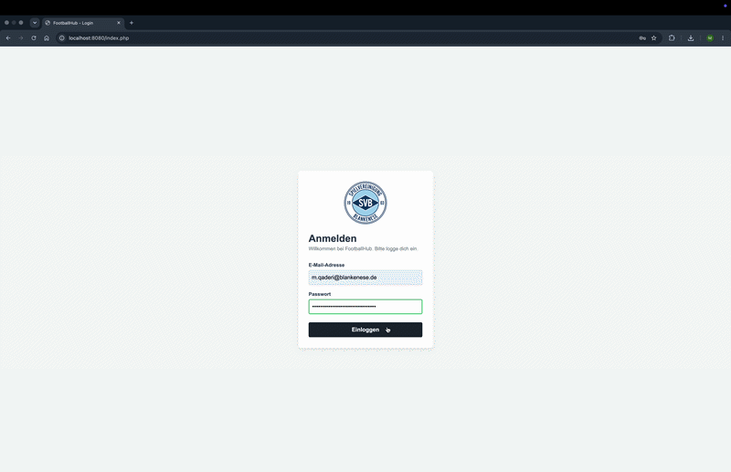
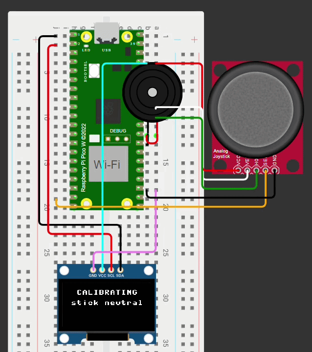

 

  

  
  
  

---

### 👨‍💻 SYSTEM_OVERVIEW // ABOUT_ME

I am currently undergoing vocational retraining as an **IT Systems Integration Specialist** in Hamburg (expected graduation: **January 2028**), bridging the gap between infrastructure and software development. 

My journey in tech began with studying Computer Science, where I built a strong foundation in **theoretical computer science, computer architecture, Java and UML**. Today, I combine that theoretical knowledge with hands-on system administration. Whether I'm building custom PCs for friends and family, troubleshooting complex IT issues, or writing full-stack code, I love solving both hardware and software puzzles.

🌍 **Languages:** German (Native) &nbsp;•&nbsp; Dari (Native) &nbsp;•&nbsp; English (Fluent) &nbsp;•&nbsp; Spanish (Basic)

> 💡 *I am actively looking for **internships, working student positions and training projects** in System Integration, Cloud Architecture or DevOps.*

---

### 🎯 CURRENT_LEARNING_FOCUS

   
  
  
<b>Operating Systems & Architecture &nbsp;•&nbsp; Python & PHP/SQL &nbsp;•&nbsp; Networking & Linux</b>

  
   
  
  
<b>Deploying Web Apps via Render &nbsp;•&nbsp; Game Development (Unreal Engine) &nbsp;•&nbsp; Hardware Tinkering</b>

   
  
  
<b>Cloud Fundamentals (AWS/Azure) &nbsp;•&nbsp; CI/CD Pipelines</b>

   

---

### 🚀 FEATURED_PROJECTS

 

  <b>Browser-Based Multiplayer Party Game</b> 
  An imposter-style drawing game built to be the perfect Discord hangout game. Currently working on deploying the full stack via Render for live multiplayer lobbies.
   
  
  
  

<!-- Hier ist das eingebundene GIF -->

  

 

  <b>Role-Based Team Management Web Application</b> 
  Features secure login, customized dashboards for coaches & players, and tactical line-up tools. Built during my web development training module.
   
  
  
  

<!-- Hier ist das eingebundene GIF -->

  

 

  <b>Embedded Retro Arcade Console</b> 
  Built on a Raspberry Pi Pico 2W with an OLED display and joystick controls. Developed to deepen my understanding of hardware-software interaction.
   
  
  
  

<!-- Hier ist das eingebundene GIF -->

  

### ⚡ BEYOND_THE_TERMINAL // OFF_SCREEN

When I'm not writing code or configuring systems, you can usually find me doing one of these:

- 🎵 **Music & Audio:** I've been producing music as a hobby using FL Studio for over 15 years.
- 🎹 **Self-Taught Pianist:** I've been playing the piano since the age of 5 — entirely self-taught through trial and error, heavily inspired by the childhood show *"Little Einsteins"*!
- ⚽ **Sports:** Passionate football player since I was a kid.
- 🛠️ **Hardware Tinkerer:** I love building custom PCs and acting as the go-to IT support for my friends and family.
- 🎮 **Game Dev Explorer:** Beyond web games, I enjoy experimenting with the Unreal Engine to bring creative ideas to life.

---

### ⚙️ CORE_TECHNOLOGIES

<h4 align="center">Languages & Scripting</h4>

  

<h4 align="center">Infrastructure & Tools</h4>

  

<h4 align="center">Environments & Design</h4>

  
    
  

---

### 📈 GITHUB_ANALYTICS

  

 

  <em>Always open to discussing internships, working student roles, and opportunities in System Integration, Cloud & DevOps — feel free to connect!</em>
    
  
   
  © 2026 Musawar Qaderi • Engineered in Hamburg

