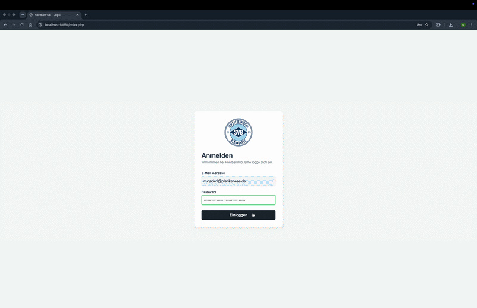
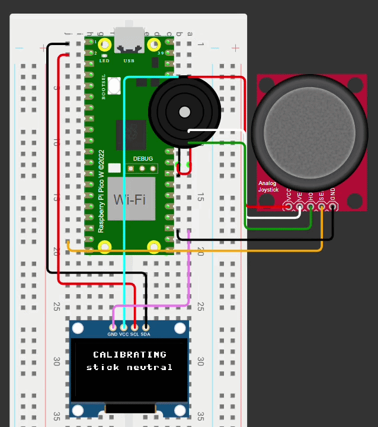

  

  
  
  
  

---

### 👨‍💻 SYSTEM_OVERVIEW // ÜBER_MICH

Als angehender **Fachinformatiker für Systemintegration** (voraussichtlicher Abschluss: **Januar 2028** in Hamburg) ist es mein Ziel, die Brücke zwischen robuster IT-Infrastruktur und moderner Softwareentwicklung zu schlagen. 

Mein analytisches Fundament habe ich durch ein Informatikstudium (Fokus auf theoretische Informatik, Rechnerarchitektur & Java) gelegt. Heute kombiniere ich dieses Wissen mit praxisnaher Systemadministration. Egal, ob ich Serverlandschaften konfiguriere, Cloud-Deployments automatisiere oder Full-Stack-Anwendungen baue – ich bin in meinem Element, wenn Hard- und Software nahtlos ineinandergreifen.

🌍 **Sprachen:** Deutsch (Muttersprache) &nbsp;•&nbsp; Dari (Muttersprache) &nbsp;•&nbsp; Englisch (Fließend) &nbsp;•&nbsp; Spanisch (Grundkenntnisse)

> 💡 *Ich bin aktiv auf der Suche nach **Praktika, Werkstudentenstellen und Ausbildungsprojekten** in den Bereichen Systemintegration, Cloud-Architektur oder DevOps.*

---

### ⚙️ CORE_TECHNOLOGIES // MEIN_TECH_STACK

<b>Infrastruktur, Cloud & Tools</b>

  

<b>Sprachen, Web & Datenbanken</b>

  

<b>IDE, Design & Engines</b>

  

---

### 🚀 FEATURED_PROJECTS // MEINE_PROJEKTE

<table border="0" width="100%">
<tr>
<td width="55%" valign="top">
  
  
<b>Rollenbasierte Web-App (Aktuell in DevOps-Migration)</b> 
  Ursprünglich als lokales PHP/SQL-Projekt während des PHP-Moduls in der Umschulung entwickelt, migriere ich diese App derzeit in eine professionelle Cloud-Umgebung. Der Fokus liegt dabei auf Containerisierung (Docker) und automatisierten Deployments.

  
  

    
    
    
    
    
  

</td>
<td width="45%" align="center" valign="middle">
  
</td>
</tr>
  
<tr>
<td width="55%" valign="middle">
  
  
<b>Echtzeit-Multiplayer-App (Fokus: Hosting & Deployment)</b> 
  Die Idee entstand, als wir zum zwölften Mal Stadt-Land-Fluss über Discord spielten und dringend nach einer Alternative suchten. Da mein Fokus auf Systemintegration liegt, habe ich die Code-Basis größtenteils als Proof-of-Concept mit KI generiert. Mein primäres Ziel war es, eine frei zugängliche App über Render live zu deployen.

  
  
  
  
</td>
<td width="45%" align="center" valign="middle">
  
</td>
</tr>

<tr>
<td width="55%" valign="middle">
  
  
<b>Eingebettete Retro-Arcade-Konsole</b> 
  Gebaut auf einem Raspberry Pi Pico 2W mit OLED-Display und Hardware-Joystick. Ein perfektes Hands-on Projekt, um das Zusammenspiel von Hardware & Low-Level-Code zu meisern.

  
  
  
</td>
<td width="45%" align="center" valign="middle">
  
</td>
</tr>
</table>

---

### 🎯 CURRENT_LEARNING_FOCUS // AKTUELLER_FOKUS

  
  
<b>CI/CD Pipelines (Terraform/GitHub Actions) &nbsp;•&nbsp; Netzwerke und Linux &nbsp;•&nbsp; IT-Security</b>

  
  
  
<b>Cloud-Migration (FootballHub) &nbsp;•&nbsp; CI/CD & Terraform &nbsp;•&nbsp; Containerisierung (Docker)</b>

  
  
<b>Advanced Linux & Bash Scripting &nbsp;•&nbsp; Terminal-Automatisierung &nbsp;•&nbsp; Cloud Fundamentals (AWS)</b>

---

### ⚡ BEYOND_THE_TERMINAL // ABSEITS_VOM_BILDSCHIRM

Wenn ich nicht gerade code, passiert meistens das hier:

- 🎵 **FL Studio:** Beats produzieren – seit über 15 Jahren mein kreatives Ventil.
- 🎹 **Klavier:** Spiele nach Gehör seit ich 5 bin (damals inspiriert von *"Little Einsteins"* 🚀).
- 🛠️ **Hardware:** Custom-PCs bauen und der typische Familien-IT-Notdienst sein.
- 🎮 **Unreal Engine:** In der Freizeit eigene Spiele-Ideen zum Leben erwecken.
- ⚽ **Fußball:** Auf dem Platz stehen, um nach dem vielen Sitzen den Kopf frei zu kriegen.

---

### 📈 GITHUB_ANALYTICS

  

 

  
<em>Ich bin jederzeit offen für Gespräche über Praktika, Werkstudentenstellen und Möglichkeiten in den Bereichen <b>Systemintegration, Cloud & DevOps</b>.</em>

  
   
  
   
  © 2026 Musawar Qaderi • Entwickelt in Hamburg ⚓

